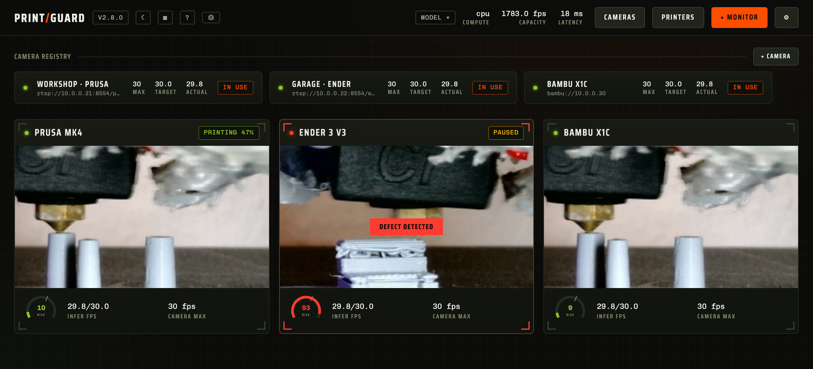
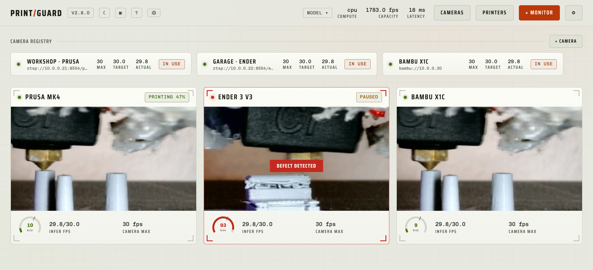
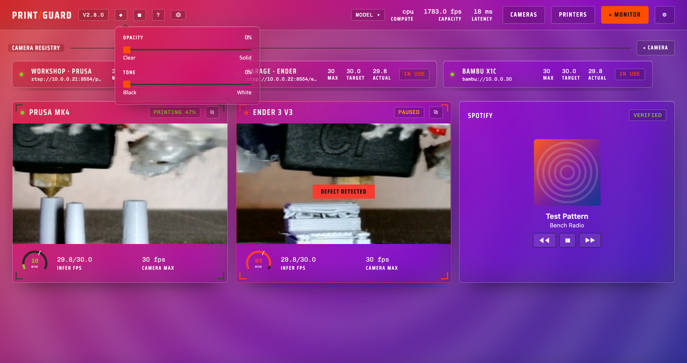
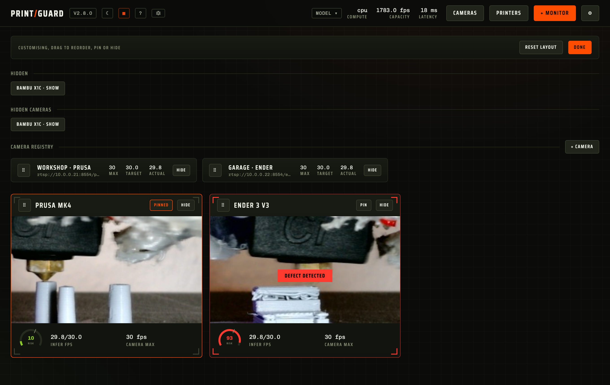
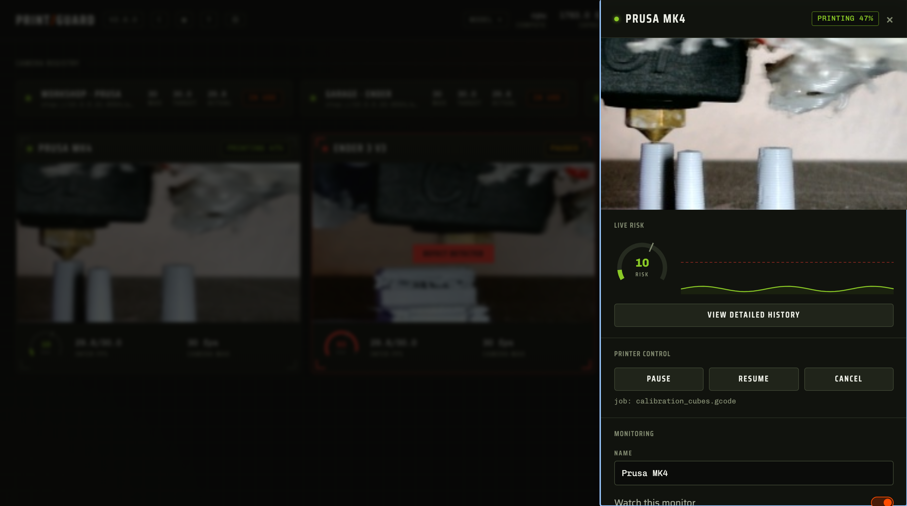
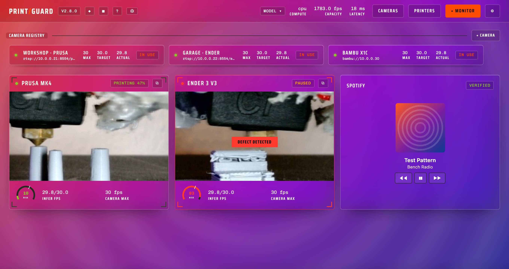

<div align="center">

# PrintGuard

**Catches failed 3D prints on your own hardware, pauses the printer and sends you a snapshot alert.**

[](https://github.com/oliverbravery/PrintGuard/releases/latest)
[](https://github.com/oliverbravery/PrintGuard/stargazers)
[](LICENSE.md)
[](https://github.com/oliverbravery/PrintGuard/pkgs/container/printguard)
[](https://oliverbravery.github.io/PrintGuard/)
[](https://github.com/sponsors/oliverbravery)

[Live demo](https://oliverbravery.github.io/PrintGuard/) · [Quick start](#quick-start) · [Documentation](docs/README.md) · [Troubleshooting](docs/troubleshooting.md) · [Contributing](CONTRIBUTING.md) · [Sponsor](#sponsor)

</div>

A compact vision model scores every camera frame on the machine you run it on. When a defect
holds for long enough, PrintGuard pauses or cancels the print through your print server and
pushes a snapshot to your phone. There's no cloud and no subscription, and your camera frames
never leave hardware you own.

In this fork, I added community model support, quick model switching and saved per-model
tuning presets through version **2.8.0**. See [Community models and tuning](#community-models-and-tuning)
for the controls and testing limits, and [Build this fork](#build-this-fork) to run these changes.
The release, container and demo links above belong to the upstream project.

I retain the upstream benchmark below for the original PrintGuard detector. It compares that
detector with the classic Spaghetti Detective model on four unseen test sets; it does not
measure the additional models or camera-specific presets in this fork.

| On a Raspberry Pi 4B | PrintGuard | Spaghetti Detective |
|---|---|---|
| Accuracy | 93.6% | 53.8% |
| F1 score | 0.937 | 0.411 |
| Images a second | 15.1 | 0.35 |

43x the throughput and more than double the F1. Method and results are in the
[dissertation](https://github.com/oliverbravery/Edge-FDM-Fault-Detection/blob/main/dissertation.pdf).



## Contents

- [Try it now, nothing to install](#try-it-now-nothing-to-install)
- [What you get](#what-you-get)
- [Quick start](#quick-start)
  - [Build this fork](#build-this-fork)
  - [Desktop app for macOS and Windows](#desktop-app-for-macos-and-windows)
  - [Docker for an always-on server or NAS](#docker-for-an-always-on-server-or-nas)
- [Local mode and hub mode](#local-mode-and-hub-mode)
- [Themes and layout](#themes-and-layout)
- [Printers, cameras and alerts](#printers-cameras-and-alerts)
- [Hardware acceleration](#hardware-acceleration)
- [Exposing a hub safely](#exposing-a-hub-safely)
- [Home Assistant](#home-assistant)
- [Automate it with MCP and the API](#automate-it-with-mcp-and-the-api)
- [Plugins](#plugins)
- [How the detector works](#how-the-detector-works)
- [Community models and tuning](#community-models-and-tuning)
- [Documentation](#documentation)
- [Contributing](#contributing)
- [Sponsor](#sponsor)
- [Licence](#licence)

## Try it now, nothing to install

**[oliverbravery.github.io/PrintGuard](https://oliverbravery.github.io/PrintGuard/)** runs the
whole engine in your browser. Point your webcam at a print and watch it score each frame live.
Nothing is installed and no frame leaves your device. When you are ready to run it for real,
[jump to Quick start](#quick-start).

## What you get

- Catches a failure early, before spaghetti runs for hours or burns a spool.
- Pauses or cancels the print through OctoPrint, Klipper, Elegoo, Prusa or Bambu Lab.
- Sends a snapshot to your phone over ntfy, Pushover, Telegram or Discord.
- Only watches while a linked printer is actually printing.
- Warns you when a camera drops, a feed freezes or a printer stops answering.
- Shares one model across as many cameras as your hardware can sustain.
- Tunes per monitor: sensitivity, threshold, how long a defect must hold, and the cooldown.
- I added a hub model picker for community ONNX, float32 TFLite and classic Obico models.
- I added optional per-model sensitivity, threshold and tested consecutive detection presets.

## Quick start

### Build this fork

I build the community-model version from this branch:

```bash
git clone --branch codex/community-model-presets https://github.com/sek0002/PrintGuard.git
cd PrintGuard
docker build -t printguard-community:2.8.0 .
docker run -d --name printguard --restart unless-stopped \
  -p 8000:8000 -p 8554:8554 \
  -v printguard:/data \
  printguard-community:2.8.0
```

I use this example for a fresh installation. For an existing hub, I back up and reuse its
data volume when replacing the container. I store additional model weights, profiles and
camera-specific presets in that volume; cloning this repository does not install them.
[Custom model setup](docs/hardware.md#custom-models) explains the required files.
The download and image commands below refer to upstream distributions.

### Desktop app for macOS and Windows

A hub on the computer next to your printer, with no Docker and no terminal. It lives in the
menu bar or system tray, so closing the window leaves the printer watched. Reach it from your
phone at `http://<computer>:8000`.

<div align="center">

[](https://github.com/oliverbravery/PrintGuard/releases/latest/download/PrintGuard-macos-arm64.dmg)
&nbsp;
[](https://github.com/oliverbravery/PrintGuard/releases/latest/download/PrintGuard-windows-x64.zip)

</div>

Turn on **Start at login** from the tray menu and forget about it.

> [!NOTE]
> The builds are unsigned for now, so the first launch needs one approval. On macOS,
> double-click the app, then open Privacy & Security in System Settings and click
> **Open Anyway** under Security. On Windows, choose **More info** and then **Run anyway**. On
> Linux, run the [Docker hub](#docker-for-an-always-on-server-or-nas) instead.

### Docker for an always-on server or NAS

PrintGuard is a single container:

```bash
docker run -d --name printguard --restart unless-stopped \
  -p 8000:8000 -p 8554:8554 \
  -v printguard:/data \
  ghcr.io/oliverbravery/printguard
```

Open `http://<host>:8000`, register a camera and your printer, then add a monitor that binds
them.

| Platform | How |
|---|---|
| **Unraid** | Add **PrintGuard** from Community Applications, or import the [template](templates/printguard.xml), and install from the UI. No terminal needed |
| **Docker Compose** | `curl -fsSLO https://raw.githubusercontent.com/oliverbravery/PrintGuard/main/docker-compose.yaml && docker compose up -d` |
| **Anything else** | The `docker run` above. Images are published for `amd64` and `arm64`, including Raspberry Pi 4 and 5 |

Port `8554` only matters for cameras that push RTSP into PrintGuard, and `-p 1935:1935` for an
RTMP push. Most setups pull from a URL or use a printer's own camera and need neither.

A USB webcam plugged into the machine reaches the container only if you pass it in, and
registers itself once you have.
[docs/printers.md](docs/printers.md#cameras-plugged-into-the-hub) has the line to add.

## Local mode and hub mode

The same detection engine runs in two places. Try it in the browser, then self-host it when you
are ready.

| | Local mode | Hub mode |
|---|---|---|
| Engine runs | In your browser, on Pyodide | On the server, on CPython |
| Model runs | [LiteRT.js in WASM](https://developers.google.com/edge/litert) | [LiteRT](https://github.com/google-ai-edge/LiteRT) or [ONNX Runtime](https://onnxruntime.ai/) |
| Frames leave the device | Never | Only to your own server |
| Survives closing the tab | No | Yes |
| Cameras | This device's webcams | Any stream, plus printer webcams and cameras plugged into the hub |
| Printers | OctoPrint and Klipper | All of them |

The desktop app is hub mode without the setup, the same persistent engine as the container in a
native window on your own computer.

## Themes and layout

Choose **System**, **Light**, **Dark**, **Glass**, or design your own in the built-in theme
editor. Themes are saved on the hub and follow every browser that opens it. Glass frosts the
panels, so a plugin putting a picture behind the dashboard shows through them.

<table>
<tr>
<td width="50%"></td>
<td width="50%"></td>
</tr>
<tr>
<td align="center"><b>Dark</b></td>
<td align="center"><b>Light</b></td>
</tr>
</table>

Picking Glass drops out two sliders, for how clear the panels are and how light or dark. Text
takes whichever colour holds 4.5:1 over what the glass is letting through, so any setting stays
readable.



Tap **Customise** to arrange the dashboard around how you work. Drag monitors into any order,
pin the ones that matter to the front and hide the rest, with a tray to bring them back. The
camera rail rearranges the same way.



Open any monitor for its live risk score, score history and one-tap printer controls.



## Printers, cameras and alerts

Register your printer, bind it to a monitor and choose whether a sustained defect alerts you,
pauses the print or cancels it. If a printer exposes a webcam, PrintGuard adds it as a camera
for you.

| | Supported |
|---|---|
| **Print services** | OctoPrint, Klipper via Moonraker, Elegoo, Prusa via PrusaLink, Bambu Lab |
| **Cameras** | Printer webcams, USB cameras plugged into the hub, RTSP, RTMP, HTTP/MJPEG, WHEP, anything pushed to the bundled MediaMTX, and the browser's own camera |
| **Alerts** | ntfy, Pushover, Telegram, Discord, and native notifications in the desktop app |

Connecting over Docker or HTTPS has a gotcha or two, as does linking an Elegoo, Prusa or Bambu
printer. The full walk-through is in **[docs/printers.md](docs/printers.md)**.

## Hardware acceleration

Hub and desktop mode carry both LiteRT and ONNX models and benchmark them on your machine at
start, keeping whichever is faster. ONNX Runtime then uses the best provider available: Core
ML on macOS, Windows ML on Windows 11 24H2 or newer, OpenVINO on Intel, TensorRT on NVIDIA.
Two extra image tags exist for GPUs:

```bash
ghcr.io/oliverbravery/printguard:latest-intel    # with --device /dev/dri
ghcr.io/oliverbravery/printguard:latest-nvidia   # with --runtime=nvidia
```

**[docs/hardware.md](docs/hardware.md)** covers which tag to pull, what each provider needs and
how to pin a runtime.

## Exposing a hub safely

> [!WARNING]
> PrintGuard has no authentication of its own. Anyone who can reach the hub sees every camera
> and can pause or cancel your printers. Never port-forward it.

Put an identity layer in front instead. **[docs/deployment.md](docs/deployment.md)** walks
through Tailscale, which is what I use for a private hub, alongside Cloudflare Tunnel with
Access and oauth2-proxy, and ends with a hardening checklist.

## Home Assistant

Point the hub at your MQTT broker in Settings and every monitor appears in Home Assistant
through MQTT discovery, with a defect sensor, the score, the latest snapshot and an **Enabled**
switch. A linked printer adds live status with **Pause**, **Resume** and **Cancel**. Control is
two-way, so your automations can drive PrintGuard.

## Automate it with MCP and the API

Anything the dashboard can do, an agent or a script can do. Point an MCP client at
`https://<host>/mcp/`, or use the REST API at `/api/v1`. Both read printer and camera status,
fetch the current frame as an image, and pause, resume or cancel.

Tokens are scoped and issued from Settings. `read` is status only, `control` adds the printer
actions and `manage` adds the rest. `GET /api/health` needs no token and reports readiness and
version. **[docs/api.md](docs/api.md)** has the full reference.

## Plugins

Plugins are written in JavaScript and run in a sandbox. Install verified ones from the store in
Settings, or from a GitHub repo or a zip. They ask for fine-grained permissions when you enable
them, and you can take those back at any time.

Four come as standard:

- **Picture in picture** floats a camera above your other windows
- **Alert sounds** plays a horn the moment a defect is caught
- **Progress reports** sends a tally of a print through your alert channels
- **Spotify** puts the cover of what you are playing behind the dashboard



Writing one takes no build step and no dependencies. **[docs/plugins.md](docs/plugins.md)** has
the API and the sandbox details.

## How the detector works

The default detector is a ShuffleNetV2 encoder classified by nearest prototype, trained for few-shot
FDM fault detection in
[Edge-FDM-Fault-Detection](https://github.com/oliverbravery/Edge-FDM-Fault-Detection), which
has an accompanying technical paper. The sensitivity and threshold sliders map straight onto
the prototype distances, so you can tune for your camera and lighting without retraining.

## Community models and tuning

I added support for community ONNX and float32 TFLite classifiers, decoded YOLOv5/YOLOv8-style
exports, and the classic Spaghetti Detective (Obico) ONNX model in hub mode. Browser-local
mode continues to use the bundled detector.

I switch models through **Model ▾ → choose a model → Use model**, or **Settings → Models**.
The selection applies to every monitor. Detection pauses while the new model loads, then
resumes with fresh detection streaks. If loading fails, I keep the previous model active.
The selector shows each model's source, declared license, experimental status and any saved
test summary. After adding a bundle under `/data/models`, I use **Refresh list** to discover it.


I can enable **Use each model’s tested preset when switching** to apply its sensitivity,
threshold and supported consecutive count to all monitors. **Apply tested settings** reapplies
the active model's preset. With presets disabled, I keep manual settings; a missing preset
keeps all current values, and a missing tested count keeps the current consecutive count.
Printer actions and cooldowns are preserved.

| Control | How I use it |
|---|---|
| Sensitivity | For community models, I scale the failure confidence around 0.5: `score = clip(0.5 + sensitivity × (confidence − 0.5), 0, 1)`. At 1.0, the score equals the model's confidence. Higher sensitivity moves scores away from 0.5; it does not raise every score. The default detector instead scales its prototype-distance margin. |
| Threshold | I count a scored frame as a detection when its score is at least this value. Lower values accept more detections, including possible healthy-print false alarms. |
| Consecutive detections | I require this many successive scored detections before the configured response is eligible. A score below threshold resets the streak. This is a frame count, not seconds; inference speed and cooldown also affect response timing. |

### Models assessed and testing limits

I installed and checked **14 distinct detectors** on the test deployment: the default model,
Forgetti Nano and Small, Javiai YOLOv5, the Klipper community detector, MobileNetV2 versions
v2/v3/v4, MobileViT XXS, classic Obico, PatchCore, two YOLO11 defect models and the YOLOv8
fault detector. I record sources, license declarations, hashes and excluded duplicates in the
[model library](docs/model-library.md). The additional weights and deployment presets are
not bundled in this repository. A model with no stated license is not public domain.

I compared all 14 models using saved images from one confirmed healthy print and one confirmed
failed print, then replayed each model's scores at consecutive counts **1–30**. I fitted counts
on 30 healthy and 20 failed frames and checked them on another 30 healthy and 20 failed frames.

| Sequence-check result | Saved consecutive count |
|---|---|
| MobileNetV2 community v2 | 3 |
| MobileViT XXS | 3 |
| Other 12 models | No qualifying count; retain the monitor's current value |

I required a count to suppress every healthy test streak while retaining at least one failed
test streak. Passing this check does not establish overall detection quality: all current
camera-specific presets remain labelled **trial**, rather than general recommendations.
The saved frames were sampled about 1.5 seconds apart and are correlated within each print.
I have not established full-rate failure-onset latency or performance across different
printers, materials and lighting. I keep private camera images and deployment credentials
out of this repository.

I document profile formats, preprocessing and preset files in
[Custom models](docs/hardware.md#custom-models).

## Documentation

| Page | Covers |
|---|---|
| [docs/printers.md](docs/printers.md) | Printers, cameras, notification channels, and the networking caveats |
| [docs/hardware.md](docs/hardware.md) | Image variants, model runtimes, GPU and NPU acceleration |
| [docs/model-library.md](docs/model-library.md) | Assessed community models, sources, declared licenses and installation limits |
| [docs/deployment.md](docs/deployment.md) | Reaching a hub from outside your LAN, and hardening it |
| [docs/troubleshooting.md](docs/troubleshooting.md) | Symptom-first fixes, and how to pull logs and diagnostics |
| [docs/api.md](docs/api.md) | REST API and MCP server, scoped tokens, every endpoint and tool |
| [docs/plugins.md](docs/plugins.md) | Installing plugins, what they can reach, and writing your own |
| [docs/architecture.md](docs/architecture.md) | One engine on two runtimes, the platform contract, the scheduler, the fail-safe design |
| [CHANGELOG.md](CHANGELOG.md) | What changed in every release |

## Contributing

Dev setup, tests, and step-by-step guides for adding a printer integration or a notification
provider are in **[CONTRIBUTING.md](CONTRIBUTING.md)**. Issues and pull requests are welcome.

## Sponsor

PrintGuard is free, GPL-2.0, and has no paid tier. It has one cost I cannot design around.
Apple charges $99 a year for the Developer Program, and without it the macOS app cannot be
signed or notarised. That is why macOS warns you that PrintGuard is from an unidentified
developer, and why the first launch takes a trip through System Settings.

[**Sponsoring the project**](https://github.com/sponsors/oliverbravery) fixes that. Sustained
sponsorship of $10 a month covers the licence across the year and removes that warning for
everyone. Anything past it goes on the hardware the integrations get tested against. One-off
and monthly both work, and nothing in PrintGuard is ever locked behind it.

## Licence

[GPL-2.0-only](LICENSE.md).
