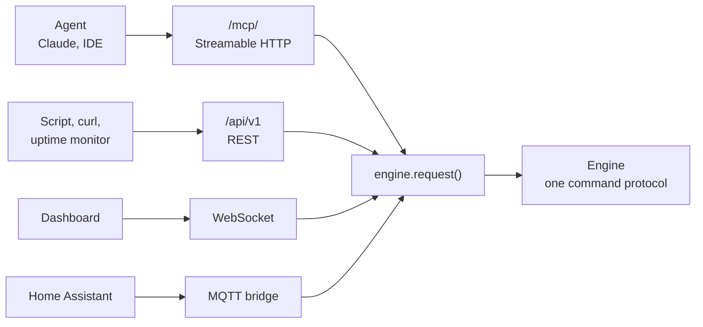

<div align="center">

# API and MCP

[Docs](README.md) · [Architecture](architecture.md) · [Printers & cameras](printers.md) · [Hardware](hardware.md) · [Deployment](deployment.md) · **API & MCP** · [Plugins](plugins.md) · [Troubleshooting](troubleshooting.md)

</div>

A hub exposes its engine to scripts and agents through two transports over one protocol. Both
send the same commands the dashboard sends, so neither can drift from the UI.

- [Surfaces](#surfaces)
- [Health and version](#health-and-version)
- [Authentication and scopes](#authentication-and-scopes)
- [REST API](#rest-api)
- [MCP server](#mcp-server)
- [The resource model](#the-resource-model)
- [Reading detection state](#reading-detection-state)

## Surfaces



| Surface | Endpoint | Auth |
|---|---|---|
| MCP server | `/mcp/`, Streamable HTTP | Bearer token |
| REST API | `/api/v1` | Bearer token |
| Health probe | `/api/health` | None |
| Home Assistant | Your MQTT broker | Broker credentials |

All of them are hub only. Local mode has no server to host them.

## Health and version

`GET /api/health` is the unauthenticated readiness endpoint for uptime checks and update
monitors. The response is never cached and carries the installed version:

```json
{"ok": true, "version": "2.3.8"}
```

It returns `200 OK` only once the engine has started. Camera, printer and notifier health
live behind the authenticated API and deliberately do not affect this probe.

## Authentication and scopes

PrintGuard has no identity layer of its own, so put a proxy in front of the hub first
([Deployment](deployment.md)). On top of that, this surface is gated by capability scopes.

Scopes are cumulative:

| Scope | Grants |
|---|---|
| `read` | Status of monitors, printers and cameras, the current camera frame, recent events |
| `control` | Everything in `read`, plus pause, resume and cancel |
| `manage` | Everything in `control`, plus adding, editing and removing cameras, printers and monitors, changing settings, testing services and discovering cameras |

Issue tokens from the API & MCP access tab in Settings. Name a token, choose its scope and
press **Generate**. The secret, a `pg_…` string, is only shown once:

```http
Authorization: Bearer pg_Zr8...agent
```

| Token state | Behaviour |
|---|---|
| No tokens issued, the default | The surface is read-only and trusts whatever fronts it. Control and management stay closed |
| Any token issued | A valid bearer is required for every request, and its scope decides what it reaches. MCP additionally **hides** tools a token cannot use |

> [!IMPORTANT]
> Only a hash is stored, so a lost token cannot be recovered. Revoke it and issue another.
> Revocation is immediate. Tokens are managed from the UI only, never over the API, so an
> agent holding a `manage` token can drive printers and cameras but cannot mint or escalate
> tokens. Serve the hub over HTTPS so tokens never travel in clear.

## REST API

Base path `/api/v1`. JSON in and out, except the camera frame, which is `image/jpeg`.
Mutating endpoints return the affected collection. The interactive OpenAPI schema is served
at `/api/v1/docs`.

<details open>
<summary><b>Read</b></summary>

| Method | Path | Description |
|---|---|---|
| `GET` | `/state` | Full snapshot: cameras, printers, monitors, settings, stats |
| `GET` | `/monitors` | List monitors with camera, linked printer and latest alert |
| `GET` | `/monitors/{id}` | One monitor |
| `GET` | `/printers` | List registered printers with status, progress and job |
| `GET` | `/printers/{id}` | One printer |
| `GET` | `/cameras` | List cameras with rate, health and latest score |
| `GET` | `/cameras/{id}` | One camera |
| `GET` | `/cameras/{id}/frame` | Freshest frame as `image/jpeg` |
| `POST` | `/classify` | Classify a supplied frame, body `image/jpeg`, `?sensitivity=`. No registered camera needed |
| `GET` | `/events` | Recent alerts, warnings, device changes and errors |

</details>

<details>
<summary><b>Control</b></summary>

| Method | Path | Description |
|---|---|---|
| `POST` | `/printers/{id}/action` | `{"action": "pause" \| "resume" \| "cancel"}` |

</details>

<details>
<summary><b>Manage</b></summary>

| Method | Path | Description |
|---|---|---|
| `POST` | `/monitors` | Add a monitor, binding a camera and an optional printer |
| `PATCH` | `/monitors/{id}` | Update a monitor |
| `DELETE` | `/monitors/{id}` | Remove a monitor |
| `POST` | `/printers` | Register a printer |
| `PATCH` | `/printers/{id}` | Update a printer |
| `DELETE` | `/printers/{id}` | Remove a printer |
| `POST` | `/printers/test` | `{"provider", "config"}`, reachability only |
| `POST` | `/cameras` | Add a camera |
| `PATCH` | `/cameras/{id}` | Update a camera |
| `DELETE` | `/cameras/{id}` | Remove a camera |
| `POST` | `/cameras/discover` | List attachable, unregistered sources |
| `POST` | `/cameras/refresh-printers` | Register cameras newly exposed by registered printers |
| `PATCH` | `/settings` | Update settings, for example notifiers |
| `POST` | `/notifiers/test` | `{"provider", "config"}`, sends a test alert |

</details>

```bash
# Status of every printer
curl -H "Authorization: Bearer $TOKEN" https://host/api/v1/printers

# Save the current frame of a camera
curl -H "Authorization: Bearer $TOKEN" https://host/api/v1/cameras/$CAM/frame -o frame.jpg

# Pause a print
curl -X POST -H "Authorization: Bearer $TOKEN" -H "Content-Type: application/json" \
  -d '{"action":"pause"}' https://host/api/v1/printers/$PRINTER/action

# Classify a supplied frame, no registered camera needed
curl -X POST -H "Authorization: Bearer $TOKEN" -H "Content-Type: image/jpeg" \
  --data-binary @frame.jpg https://host/api/v1/classify
# gives {"prediction":"success","distances":{...},"margin":1.16,"defect_score":0.35}
```

## MCP server

Endpoint `https://<host>/mcp/`, transport **Streamable HTTP**, same bearer token. Tools
mirror the REST operations one to one by `operation_id`, and the list a client sees is
filtered to the scopes its token holds.

| Scope | Tools |
|---|---|
| `read` | `get_state`, `list_monitors`, `get_monitor`, `list_printers`, `get_printer`, `list_cameras`, `get_camera`, `recent_events` |
| `read` | `get_camera_frame`, which returns the frame as image content an agent can look at |
| `control` | `control_printer` |
| `manage` | `add_monitor`, `update_monitor`, `remove_monitor`, `add_printer`, `update_printer`, `remove_printer`, `test_printer`, `add_camera`, `update_camera`, `remove_camera`, `discover_cameras`, `refresh_printer_cameras`, `update_settings`, `test_notifier` |

Point a client at the endpoint with the token as a bearer header:

```json
{
  "mcpServers": {
    "printguard": {
      "url": "https://host/mcp/",
      "headers": { "Authorization": "Bearer YOUR_TOKEN" }
    }
  }
}
```

Or explore it with the [MCP Inspector](https://github.com/modelcontextprotocol/inspector):

```bash
npx @modelcontextprotocol/inspector
# Transport: Streamable HTTP · URL: https://host/mcp/
# Header: Authorization: Bearer YOUR_TOKEN
```

## The resource model

Cameras and printers are registered resources, created and deleted only through their own
collection. A monitor binds one camera and optionally one printer by `camera_id` and
`printer_id`, and carries the thresholds and defect-response policy. Removing a resource
clears it from any monitor that referenced it.

> [!NOTE]
> Credentials are redacted from this surface. Any printer or notifier config field its
> adapter marks secret, such as API keys, access codes and bot tokens, is stripped from
> every REST and MCP response. Only the dashboard's own WebSocket, behind your proxy,
> receives them.

Every integration is normalised to one shape, so a printer reads and controls the same way
regardless of its service:

| | Values |
|---|---|
| **Status** | `printing`, `paused`, `idle`, `error`, `offline`, `unknown` |
| **State** | `{ "status", "progress" 0-100, "job" }`, reported on printers as `device_state` |
| **Actions** | `pause`, `resume`, `cancel` |

## Reading detection state

Two facts are easy to miss. A camera carries a per-frame classification, and the smoothed 0-1
defect score belongs to a monitor rather than a camera, so the camera object has no numeric
score field.

The camera object, from `GET /cameras` and `GET /cameras/{id}`:

```jsonc
{
  "id": "cam_1a2b",
  "name": "Left printer",
  "source": { /* redacted of any access_code / credentials */ },
  "printer_id": "prn_…" | null,
  "declared": false,                                        // passed in by the deployment
  "max_fps": 5.0, "target_fps": 2.0, "achieved_fps": 1.9,   // rate
  "inferring": true, "in_use": true, "online": true,        // health
  "last_result": {                                          // latest score (per FRAME)
    "prediction": "success",                                //   "success" | "failure" | "unknown"
    "distances": { "success": 0.48, "failure": 1.64 },      //   distance to each class prototype
    "margin": 1.16                                          //   runner-up minus best (confidence)
  },
  "brightness": 1.0, "contrast": 1.0, "sharpness": 0.0, "crop": null, "rotation": 0
}
```

`last_result` is the newest raw classification, or `null` before the camera has been
inferred. `prediction` is the nearest class prototype for that frame with no threshold applied, which makes it the quickest per-camera "failing?" read. It is `"unknown"` when the
frame cannot be classified, for example when the embedding is not finite.

The monitor object, from `GET /monitors` and `GET /monitors/{id}`:

```jsonc
{
  "id": "mon_…",
  "camera_id": "cam_1a2b",
  "printer_id": "prn_…" | "",
  "sensitivity": 1.0,          // scales how far the distance margin moves the score off 0.5
  "threshold": 0.6,            // defect score at/above which a frame counts as a failure
  "watching": true,            // whether it is actively inferring right now
  "result": {                  // latest per-monitor score, or null before the first inference
    "score": 0.42, "ts": 1720000000.0
  },
  "alert": {                   // null until a sustained defect trips the watchdog
    "score": 0.82, "action": "pause", "ts": 1720000000.0
  }
}
```

### Prediction against defect score

The 0-1 defect score, where `0.5` is the decision boundary and higher is more defective,
applies a monitor's `sensitivity` to the frame's distance margin, so it is per-monitor rather
than per-camera. It appears in:

- `result` events on the WebSocket:
  `{ "event": "result", "monitor_id", "camera_id", "score", "prediction", "margin", "ms", "ts" }`,
  where `prediction` has that monitor's `threshold` applied, sampled at up to 5 Hz per
  monitor,
- the monitor object's latest `result`, also carried by every full `state` snapshot,
- a monitor's `alert.score` once it trips,
- the MQTT **Defect score** sensor, published as 0-100.

To poll one camera's current verdict, read `GET /cameras/{id}` and take
`last_result.prediction`. For the smoothed score or a threshold-applied verdict, read the
monitor or the `result` events.

### Installed models

The state response includes `models` (installed metadata, compatible runtimes and validation
errors) and `model_selection` (whether switching is supported). With a manage token, send
`PATCH /api/v1/settings` with `{"model_id":"obico-classic"}` to select an installed model.
The server allows up to 120 seconds for model validation and loading. A failed switch keeps
the previous settings. The dashboard uses `settings.update` and `models.refresh` over the
shared command protocol. See [Custom models](hardware.md#custom-models).

`PATCH /api/v1/settings` accepts `model_presets_enabled`. Setting it to `true` applies the
active model's tested sensitivity, threshold and optional consecutive count to every monitor and enables presets on
future model switches. Setting it to `false` preserves manual tuning across switches.
Each `models` entry may include `recommendation` with preset values and evaluation limits.
