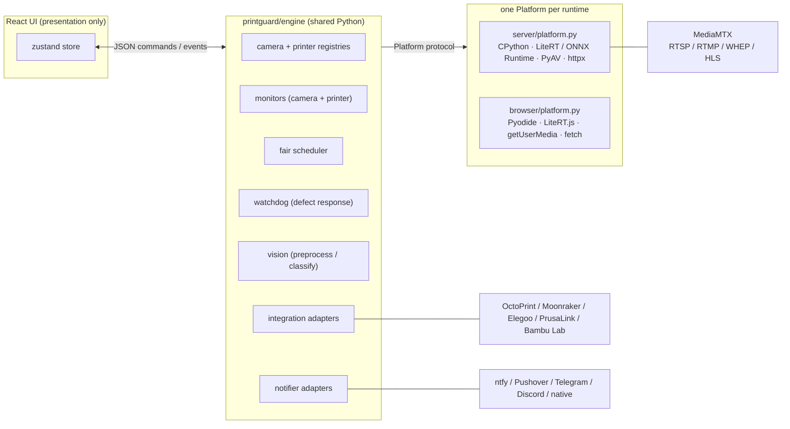
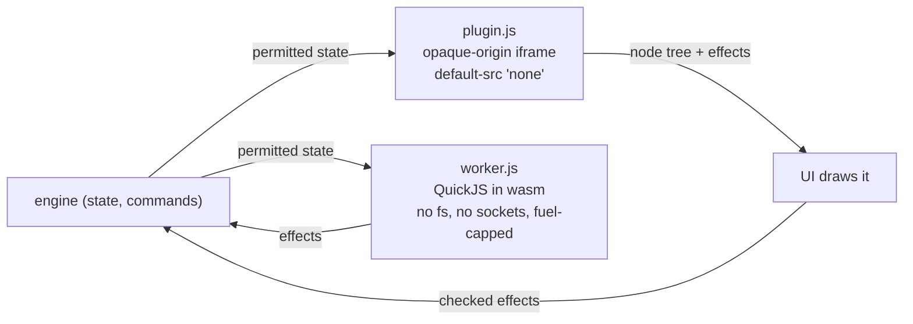
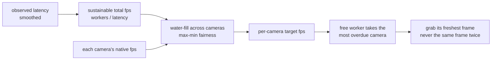
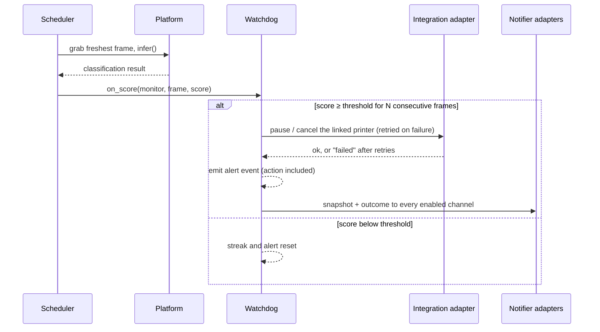
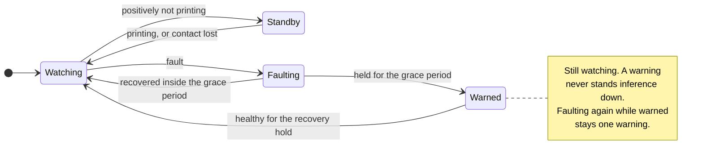

<div align="center">

# Architecture

[Docs](README.md) · **Architecture** · [Printers & cameras](printers.md) · [Hardware](hardware.md) · [Deployment](deployment.md) · [API & MCP](api.md) · [Plugins](plugins.md) · [Troubleshooting](troubleshooting.md)

</div>

PrintGuard is a monolith whose engine is shared code, running unchanged on CPython in hub
mode and on Pyodide in the browser in local mode. Everything mode-specific is confined to
one `Platform` implementation per runtime. The two modes cannot drift apart because there is
nothing to drift, since they execute the same files.

- [The shape of it](#the-shape-of-it)
- [The platform contract](#the-platform-contract)
- [The protocol](#the-protocol)
- [Resources and monitors](#resources-and-monitors)
- [Updates and bug reports](#updates-and-bug-reports)
- [Logging](#logging)
- [The programmatic surface](#the-programmatic-surface)
- [Plugins](#plugins)
- [Scheduling inference](#scheduling-inference)
- [The defect pipeline](#the-defect-pipeline)
- [Failing safely](#failing-safely)
- [Repository layout](#repository-layout)
- [The static demo](#the-static-demo)

## The shape of it



## The platform contract

[`engine/platform.py`](../printguard/engine/platform.py) defines everything the engine needs
but cannot implement portably. Identical signatures, different runtimes:

| Method | Hub (CPython) | Local (browser) |
|---|---|---|
| `configure(settings)` | Validates and activates the selected installed model and compatible runtime | No-op |
| `models`, `model_selection`, `refresh_models()` | Installed model metadata, selection capability and library rescan | Fixed default model, no switching |
| `infer(rgb)` | Bundled LiteRT/ONNX encoder or a profiled community ONNX/TFLite model | LiteRT.js in WASM via a JS bridge |
| `discover_cameras()` | V4L2, AVFoundation or DirectShow capture devices, plus the MediaMTX path list | `enumerateDevices()` |
| `open_camera(id, source)` | PyAV reader thread; MediaMTX pulls RTSP and WHEP streams | `getUserMedia` and canvas grabs |
| `http(...)` | httpx | `fetch`, so CORS applies |
| `encode_jpeg(rgb)` | PyAV mjpeg | canvas `toBlob` |
| `load_state` / `save_state` | `data/state.json` | `localStorage` |
| `plugin_runtime` | QuickJS in WebAssembly, under wasmtime | `None`: the browser runs workers in its own sandbox |

The hub discovers bundles under `MODEL_LIBRARY_DIR` (default `/data/models`) and reads their
`model.json` profiles. The `default` entry retains the original `MODEL_DIR` behavior.
The state event includes `models` and `model_selection`; `settings.model_id` persists the
selection. `models.refresh` rescans installed bundles and validated `recommendations.json`.
`settings.model_presets_enabled` opts into applying the selected model's sensitivity, threshold and optional
consecutive-count preset after a successful switch. Enabling it reapplies the active preset. It
updates monitor tuning only; action policies and cooldowns stay intact. A missing consecutive count retains the existing value. Settings updates are serialized, and
the scheduler drains active inference before a switch. Failed validation preserves the old
runtime and settings. A successful model change clears current results and detection streaks,
while retaining alert cooldowns. Older score history remains available. Model preprocessing and
output interpretation live in `server/model_profile.py`, behind the existing `infer(rgb)` contract.
Bundled encoders return prototype distances. Custom models return `failure_probability`
alongside `prediction`, empty `distances` and a zero `margin`. Shared `vision.defect_score`
scales that confidence around 0.5 using the monitor's sensitivity. Malformed outputs raise
inference errors through the scheduler; no printer-action policy is implemented in a model
adapter. [Custom model contracts](hardware.md#custom-models) describe the supported exports.

The UI is presentation-only and speaks one JSON command and event protocol, over a WebSocket
in hub mode and over an in-page Pyodide bridge in local mode. The engine cannot tell which
transport it is on.

> [!IMPORTANT]
> **Never add mode-specific logic anywhere else.** If a feature needs a runtime service,
> extend the Platform contract on both sides with identical signatures. Where a mode merely
> lacks a capability, express that as platform data, such as `update_repo` being `None` in
> the browser, rather than a mode check.

## The protocol

Commands, UI to engine:

| Group | Commands |
|---|---|
| Cameras | `discover`, `camera.add`, `camera.update`, `camera.remove` |
| Printers | `printer.add`, `printer.update`, `printer.remove`, `printer.action`, `printer.test`, `printer.cameras.refresh` |
| Monitors | `monitor.add`, `monitor.update`, `monitor.remove` |
| History | `history.get`, `snapshot.get` |
| Plugins | `plugin.install`, `plugin.remove`, `plugin.update`, `plugin.code`, `plugin.catalogue`, `plugin.http`, `plugin.effect` |
| System | `settings.update`, `notify.test`, `token.create`, `token.remove`, `update.check`, `update.releases`, `report.send`, `report.bundle` |

Every command may carry a `req_id`, echoed on the responding event so the UI can resolve
pending requests.

Events, engine to UI:

| Event | Carries |
|---|---|
| `state` | Full snapshot, on connect, after every command and on a 1 s ticker: version, cameras, printers, monitors with their latest results, settings, stats and update status |
| `result` | One monitor's score, sampled at up to 5 Hz per monitor |
| `alert` | A sustained defect, with the action taken |
| `warning` | Watchdog conditions and their recovery |
| `device` | A printer's status, progress and job |
| `discovered`, `printer_test`, `notify_test` | Command responses |
| `history`, `snapshot` | Risk history buckets and stored alert snapshots |
| `releases` | The changelog history the update dialog browses |
| `token_created` | A new API token's secret, delivered to the requesting transport and never written to the log |
| `report_sent`, `report_bundle` | Bug report outcome, and the downloadable diagnostics zip |
| `plugin_code`, `catalogue`, `plugin_effect` | A plugin's source for its sandbox, the reviewed-plugin catalogue, and an effect a dashboard performs for a plugin that has no screen of its own |
| `http`, `socket` | An answer to a plugin's own request, and a frame on a socket it is holding, both addressed to the plugin that asked |
| `error` | Anything that failed, including failed printer actions |

Result updates are conflated when a transport is slower than 5 Hz. Ordered events and
command responses are never evicted by telemetry.

## Resources and monitors

A camera is a video source and a printer is a control-service connection. Both are
registered resources, created and deleted only in their own registry. A monitor binds one of
each, the printer optionally, and carries the inference thresholds and the
defect-response policy.

A printer integration that exposes a webcam registers it automatically as a camera owned by
that printer through `Camera.printer_id`, covering the OctoPrint and Moonraker stream URLs, the
Elegoo Centauri chamber camera, and the Bambu chamber camera, over RTSP on the X1 and H2
series or the proprietary port 6000 protocol on the A1 and P1. The adapter's optional
`cameras()` declares them, and the engine reconciles them on printer add and update, and on
demand through `printer.cameras.refresh` to pick up a camera attached later. Such cameras
cannot be removed on their own and are dropped with their printer.

A deployment can declare video devices the same way. The Docker image sets
`PRINTGUARD_CAMERAS=auto`, so every capture device passed into the container comes back from
`discover_cameras()` marked `declared`, and the engine reconciles those into the registry at
boot under a deterministic id through `Camera.declared`. A declared camera keeps the name and
tuning it was given across restarts, cannot be removed on its own, and goes when the
deployment stops passing it in.

## Updates and bug reports

`update.check` refreshes the release status against GitHub
([`engine/updates.py`](../printguard/engine/updates.py)) and `update.releases` serves the
changelog history the update dialog browses. The `state` snapshot carries only the status,
meaning version, latest and whether an update is available, because every release's notes
together dwarf the rest of the snapshot and the history is wanted only while that dialog is
open.

`report.send` is the anonymous bug report
([`engine/reports.py`](../printguard/engine/reports.py)). It is one user-initiated POST of a
Sentry feedback envelope carrying the description, an optional contact email, user-attached files,
a diagnostics bundle and the engine and UI log tails, with every credential redacted, sent
through `platform.http` so it works identically in both modes. There is no SDK and no
automatic telemetry, and nothing is sent unless the user submits a report. `report.bundle` packs
those same scrubbed files into a zip the UI downloads instead, for a user who would rather
read the diagnostics or take them somewhere else.

## Logging

One setup ([`engine/logs.py`](../printguard/engine/logs.py)) serves every runtime. Entry
points call it once and records flow to stdout for `docker logs`, to a rotating file where
no console exists, since the desktop app sets `LOG_FILE` in its data directory, and into a
bounded in-memory tail.

Emitted alert, warning, error and device events are logged as they broadcast, so the tail
carries the same timeline the UI shows plus the lifecycle around it, so boot, camera attach
and drop, resource registration, printer actions, and API and socket denials. Uvicorn runs without
its own log config so its records land in the same handlers. The UI keeps its own ring
([`web/src/log.ts`](../web/src/log.ts)) of boot milestones, socket drops, toasts, console
warnings and errors, and uncaught exceptions.

Bug reports attach both tails, scrubbed of every configured credential value, and the same
pair can be downloaded as a zip from the report dialog. `LOG_LEVEL=DEBUG` adds command
traces and exception tracebacks.

## The programmatic surface

Hub only. The MCP server, REST API and Home Assistant MQTT bridge are thin transports over
the same commands the UI sends, so they add no logic of their own and cannot drift from the
dashboard. Local mode never mounts them.

- [`engine.request()`](../printguard/engine/engine.py) turns the broadcast protocol into
  request and response by correlating a `req_id`, and `engine.snapshot()` encodes a camera's
  freshest frame as JPEG. Both are mode-agnostic engine methods.
- [`server/api.py`](../printguard/server/api.py) is a FastAPI sub-app at `/api/v1` whose
  routes delegate to those methods, each tagged with the scope it requires.
- [`server/mcp.py`](../printguard/server/mcp.py) derives its tools from that app with
  `FastMCP.from_fastapi`, adds a camera-frame tool returning native image content, and
  enforces the route scope tags so a caller only sees the tools its token may use.
- [`server/mqtt.py`](../printguard/server/mqtt.py) bridges the engine to Home Assistant. It
  subscribes to engine events as a transport sink, reconciles one MQTT device per monitor
  through Home Assistant discovery, and routes inbound commands, the Enabled switch and the
  printer buttons, back through `engine.request()`. The discovery payloads, state blob and
  command routing are pure functions, wrapped in an `aiomqtt` session that reconnects on
  failure and on a settings change. Control is gated by broker access, not by a token.

REST and MCP are gated by cumulative scopes, where `control` includes `read` and `manage`
includes both. See
[API & MCP](api.md).

## Plugins

Plugins are third-party code, and the engine runs none of it.
[`engine/plugins.py`](../printguard/engine/plugins.py) only sources it: a fetch from GitHub at
a resolved commit or a zip, manifest validation, a hash of every file, and a comparison against
the catalogue. The registry holds the result beside the cameras, printers and tokens.

Execution is a sandbox on each side. `PERMISSIONS` is the one policy both enforce, and it
reaches the UI in the state snapshot as `plugin_permissions`, the way `integrations_meta()`
already drives the config forms.



A sandbox asks for effects and PrintGuard carries them out, checking each against the grants
first. That check belongs at the sandbox edge: by the time a command reaches the engine it is
indistinguishable from one the dashboard sent.

A plugin's source never rides in the state snapshot, which broadcasts every second. It travels
on request through `plugin.code`, like `snapshot.get` and `history.get`. That response reaches
every connected client, so a tab ignores one whose `req_id` is not its own, or a second tab
starts a duplicate sandbox.

The hub mounts `/plugins/<id>/` onto a plugin's route handler and consults a `gate` plugin
before serving anything else. `PRINTGUARD_PLUGINS=off` starts with every plugin off. See
[plugins](plugins.md).

## Scheduling inference

When a camera is registered its native frame rate is measured once. From then on allocation
is fully dynamic:

1. A smoothed estimate of observed inference latency continuously yields the sustainable
   total rate, `workers / latency`. `workers` is measured once when the runtime loads, by
   adding concurrency until throughput stops growing, so the division holds rather than
   extrapolating past a ceiling the host cannot reach. See
   [model runtimes](hardware.md#model-runtimes).
2. That capacity is water-filled across in-use cameras with max-min fairness, so no camera is
   allocated beyond its native fps and surplus flows to cameras that can use it.
3. A free worker takes the most overdue camera and grabs its freshest frame at dispatch
   time. Frames carry a sequence identity, so the same frame is never inferred twice and
   results always describe the present, not a backlog.



MediaMTX bursts the buffered GOP on RTSP connect, so stream fps is trusted from the SDP
`average_rate`, and otherwise measured only after a warm-up.

Hub camera capture is demand-driven. A source stays active while an enabled monitor is
watching or while an HLS viewer is requesting it. MediaMTX pulls RTSP, RTMP and WHEP sources
on demand, and PrintGuard wakes its own MJPEG, Bambu and device-camera publisher for
viewers. A positively idle printer lets the source sleep, while an unknown or unreachable
printer keeps it active.

## The defect pipeline



A failed printer action is retried, then reported in the alert, the UI error feed and the
push notification.

## Failing safely

A monitor's watching state gates inference
([`monitors.monitor_watching`](../printguard/engine/monitors.py)):

| Linked printer reports | Watched? | Why |
|---|---|---|
| No printer linked | Yes | Nothing to gate on |
| `printing` | Yes | The job needs eyes |
| No state yet, or `unknown` | Yes | Cannot tell, so watch |
| `offline`, unreachable | Yes | Losing the signal must not stop monitoring |
| `idle`, `paused`, `error` | No, standby | Positively not printing |

Only a positive "not printing" stands inference down. The watchdog loop then keeps the
pipeline honest. A condition has to hold for the grace period before it is announced, so a
brief outage passes unremarked, and it is then repeated every thirty minutes for as long as
it lasts. Recovery is announced once health has held.



The four watchdog conditions are a watched camera going offline, a watched camera staying
online but producing no fresh frames, since a frozen RTSP feed must not pass for monitoring,
a watched camera that delivered frames for under 90% of the last ten minutes, and a linked
printer whose state cannot be read, whether it is unreachable or reporting something the
adapter does not recognise. The last one is why the monitor is watching, and it means a
defect could not pause the print, so it is checked for every enabled monitor rather than
only for watched ones.

The grace period is `settings.fault_grace_s`, two minutes by default, and it is clamped to
between thirty seconds and fifteen minutes so it can be lengthened for a camera that drops
out and comes straight back but never turned into an off switch. A camera that keeps
dropping clears the grace period every time yet is only watching part of the print, which is
what the coverage condition is for: the share of the recent window it delivered frames for
is one warning about an unreliable feed rather than one per drop.

Warnings surface as dashboard toasts and go out through the notification channels, so the
watchdog suppresses flapping rather than repeating itself. A source that reconnects and drops
again is still the same warning, and each announced recovery doubles how long the
next one must hold before it is announced, up to fifteen minutes. Only the notification
waits on the grace period. The dashboard shows a fault as it happens, and re-attaching a
failed camera runs on its own timer, so a longer grace period never delays recovery.
Notifier delivery failures and inference crashes emit `error` events. There is no silent
`except: pass` anywhere in the alert path.

## Repository layout

```
printguard/
  engine/            shared engine - runs on CPython and Pyodide
    registry.py      camera + printer registries (registered resources)
    monitors.py      monitor config: a camera + printer pairing and its thresholds
    printers.py      registered-printer (integration connection) validation
    watchdog.py      defect response: streaks, printer actions, notifications, health
    updates.py       GitHub release check and changelog history
    reports.py       anonymous bug report and downloadable diagnostics bundle
    plugins.py       plugin sourcing, hash pinning and the permission table (never executes)
    integrations/    printer service adapters (OctoPrint, Klipper, Elegoo, PrusaLink, Bambu Lab, …)
    notifiers/       alert channel adapters (ntfy, Pushover, Telegram, Discord, native desktop, …)
    adapters.py      shared adapter contract (id, label, docs_url, JSON-schema config)
  server/            hub platform: FastAPI, bundled MediaMTX (child process), LiteRT / ONNX Runtime, PyAV
    api.py           REST API (/api/v1) over the engine protocol, scoped by token
    mcp.py           MCP server for agents, derived from the REST API
    mqtt.py          Home Assistant MQTT bridge (device discovery + two-way control)
    plugins.py       plugin worker sandbox: QuickJS in WebAssembly, under wasmtime
    runtime/         the vendored quickjs-ng WASI build the sandbox runs
    mediamtx.py      MediaMTX control client and supervisor for the bundled binary
    bambu_camera.py  Bambu A1/P1 chamber-camera reader (proprietary port-6000 protocol)
    desktop.py       macOS and Windows tray app around the hub
  browser/           local platform: Pyodide bridge to LiteRT.js and getUserMedia
  pysrc.py           builds the engine source archive Pyodide unpacks
web/                 React + Tailwind UI (presentation only)
  public/            plugin-sandbox.html, the opaque-origin frame a plugin panel runs in
plugins/             first-party plugins and the hash-pinned catalogue they are verified by
models/              TFLite and ONNX encoders, normalisation metadata, class prototypes
tests/               engine simulation, adapter contracts and the plugin sandbox (pytest)
```

## The static demo

Local mode needs no backend at all, so the same `web/dist` build deploys to GitHub Pages.
The release workflow zips the engine source with `printguard/pysrc.py`, copies `models/` into
the bundle, and every asset is fetched base-relative. The mode picker probes `api/health`,
and when no hub answers the hub card becomes a Docker self-host link.

Because the demo is most people's first contact with PrintGuard, local mode opens a notice
listing what a hub adds (`web/src/components/DemoDialog.tsx`). It shows once per browser,
keyed on `pg.demo.seen` in `localStorage`, and the header's **local** chip reopens it. The
list is copy, not capability data, since the dialogs already hide what a mode cannot do
through each adapter's `browser_ok` flag.
