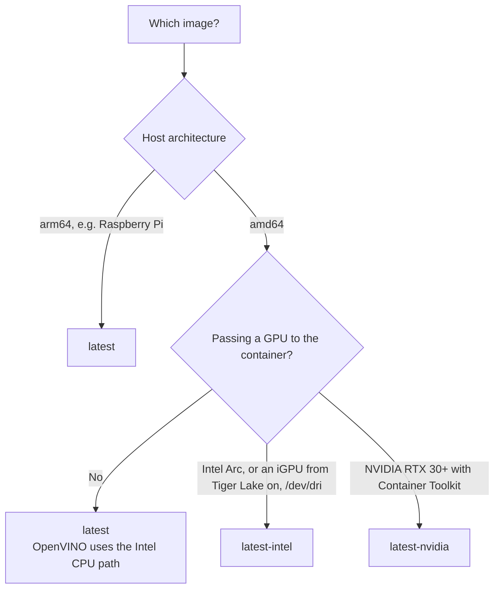
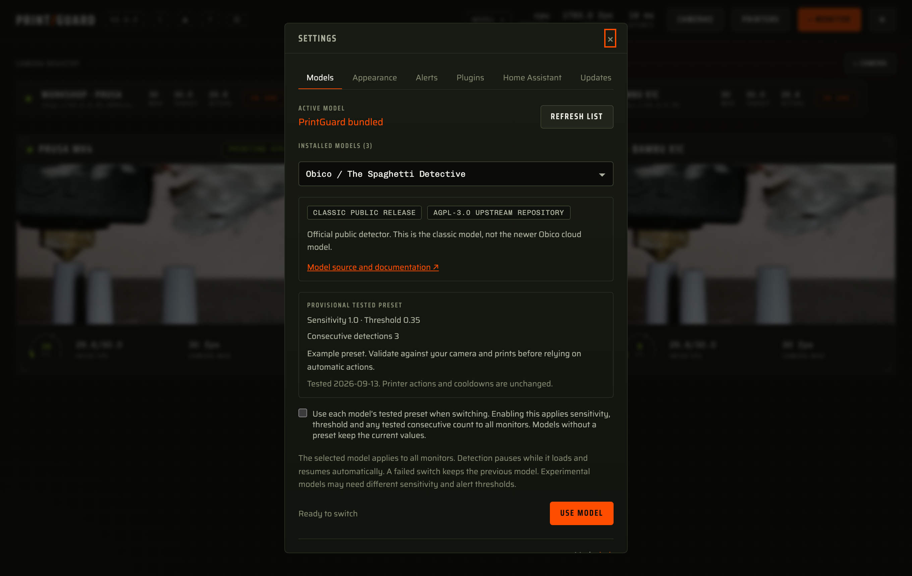

<div align="center">

# Hardware and model runtimes

[Docs](README.md) · [Architecture](architecture.md) · [Printers & cameras](printers.md) · **Hardware** · [Deployment](deployment.md) · [API & MCP](api.md) · [Plugins](plugins.md) · [Troubleshooting](troubleshooting.md)

</div>

Which image to pull, how PrintGuard picks a model runtime, and how to give it a GPU or NPU.

- [How much hardware you need](#how-much-hardware-you-need)
- [Image variants](#image-variants)
- [Choosing a variant](#choosing-a-variant)
- [Model runtimes](#model-runtimes)
- [Custom models](#custom-models)
- [Execution providers by platform](#execution-providers-by-platform)
- [Intel GPU](#intel-gpu)
- [NVIDIA GPU](#nvidia-gpu)
- [Reading and pinning the runtime](#reading-and-pinning-the-runtime)

## How much hardware you need

The detector is a compact encoder, not a large model. A Raspberry Pi 4 handles a camera or
two, and any modern x86 mini PC handles several. Inference is only one part of the load.
Decoding video costs more than classifying it, so frame rate and resolution matter more than
raw model throughput.

PrintGuard never needs a fixed frame rate. The scheduler measures what the host can
sustain and shares that capacity across the cameras in use, so adding a camera lowers each
camera's rate rather than falling behind. See
[scheduling inference](architecture.md#scheduling-inference).

> [!TIP]
> The dashboard's **capacity** and **latency** readouts show what your host actually
> sustains. If capacity sits far above the sum of your cameras' rates, you have headroom
> for more cameras.

## Image variants

Every release publishes three tags. All three carry the same engine and UI, and differ only
in the acceleration runtime they bundle.

| Tag | Platforms | Adds | Use it when |
|---|---|---|---|
| `latest` | `amd64`, `arm64` | Nothing. Smallest download | Default choice, including Raspberry Pi 4/5 |
| `latest-intel` | `amd64` | Intel's current GPU compute runtime | You pass `--device /dev/dri` for an Arc card, or an iGPU from Tiger Lake (11th gen) onwards |
| `latest-nvidia` | `amd64` | TensorRT RTX execution provider and the CUDA 12 runtime | You have an RTX 30 series or newer and the NVIDIA Container Toolkit |

Versioned tags exist alongside them: `X.Y.Z`, `X.Y`, and the same three suffixes, for
example `2.3.8-intel`. Pin `X.Y` if you want patch updates without surprises.

> [!NOTE]
> The Intel GPU compute runtime is roughly 370 MB of compiler and driver libraries that do
> nothing unless a GPU device is passed in, which is why it lives in its own tag rather
> than the default image. Intel **CPU** acceleration through OpenVINO is in the standard
> `amd64` image and needs no extra tag.

## Choosing a variant



macOS and Windows users running the desktop app do not choose a variant, since the app
carries the runtimes for its platform.

## Model runtimes

By default, hub and desktop mode carry the bundled model twice, once for each runtime, and pick between them:

| Runtime | What it is | Path used |
|---|---|---|
| [LiteRT](https://github.com/google-ai-edge/LiteRT) | Google's on-device runtime, formerly TensorFlow Lite | Optimised CPU |
| [ONNX Runtime](https://onnxruntime.ai) | Cross-platform runtime with pluggable execution providers | The fastest provider available on the host |

**Automatic** is the default. On start, PrintGuard benchmarks both runtimes for concurrent
throughput on the machine it is actually running on and keeps the faster one. The choice is
logged, so `docker logs printguard` shows what won and by how much.

The same benchmark also decides how many frames PrintGuard infers at once. It adds workers
while each one still pays for itself and stops at the host's real ceiling, which is not the
core count. An accelerator serialises on one device, a runtime's Python binding may hold the
interpreter lock, and a container may be under a CPU quota. Measuring covers all three, and
the result is the `workers` term the scheduler divides by latency to get
[capacity](architecture.md#scheduling-inference).

Local mode is different. The browser runs
[LiteRT.js](https://developers.google.com/edge/litert) in WebAssembly, which is the only
option a browser tab has.

## Execution providers by platform

ONNX Runtime selects the fastest provider it can use. What is available depends on the
platform:

| Platform | Provider | Notes |
|---|---|---|
| macOS, desktop app | Core ML | Uses CPU, GPU and the Neural Engine |
| Windows 11 24H2 or newer, desktop app | Windows ML | Installs the certified Intel, NVIDIA, AMD or Qualcomm provider on first launch |
| Older Windows, desktop app | Optimised CPU | No provider install |
| Linux `amd64`, standard image | OpenVINO | Intel CPU path out of the box, and the GPU needs `latest-intel` and `/dev/dri` |
| Linux `amd64`, `latest-nvidia` | TensorRT RTX | Needs the NVIDIA Container Toolkit on the host |
| Linux `arm64`, standard image | Optimised CPU | Raspberry Pi 4/5 and similar |

If no accelerator is usable, ONNX Runtime falls back to its CPU provider and PrintGuard
keeps working.

## Intel GPU

Use the Intel image and pass the render device:

```bash
docker run -d --name printguard --restart unless-stopped \
  --device /dev/dri \
  -p 8000:8000 -p 8554:8554 \
  -v printguard:/data \
  ghcr.io/oliverbravery/printguard:latest-intel
```

Compose:

```yaml
    image: ghcr.io/oliverbravery/printguard:latest-intel
    devices:
      - /dev/dri:/dev/dri
```

On Unraid, set the repository to `ghcr.io/oliverbravery/printguard:latest-intel` and add
the template's **Intel GPU** device.

The image carries Intel's own current compute runtime rather than the distribution's, which
covers Arc and Battlemage cards and every iGPU from Tiger Lake (11th gen) onwards. Intel
provides no current driver for Gen8 to Gen11 graphics, so a pre-Tiger-Lake iGPU has no GPU
path and inference stays on the OpenVINO CPU path.

**compute** in the header names the hardware in use, so it reads `intel gpu` once the GPU
is running the model, and `intel cpu` while OpenVINO is on the processor. The log lists
everything the providers offered at start:

```
execution providers offer: Intel GPU, Intel CPU
```

A GPU missing from that line is one the driver never handed over. Check that the device is
passed in with `--device /dev/dri` and that the tag ends in `-intel`.

## NVIDIA GPU

Needs an RTX 30 series card or newer and the
[NVIDIA Container Toolkit](https://docs.nvidia.com/datacenter/cloud-native/container-toolkit/latest/install-guide.html)
on the host:

```bash
docker run -d --name printguard --restart unless-stopped \
  --gpus all \
  -p 8000:8000 -p 8554:8554 \
  -v printguard:/data \
  ghcr.io/oliverbravery/printguard:latest-nvidia
```

Compose:

```yaml
    image: ghcr.io/oliverbravery/printguard:latest-nvidia
    runtime: nvidia
```

On Unraid, set the repository to the `-nvidia` tag and add `--runtime=nvidia` to **Extra
Parameters**.

The image asks the Container Toolkit for every GPU on the host and carries the CUDA 12
runtime the provider needs, so the toolkit is the only thing to install. To pick one card,
set `NVIDIA_VISIBLE_DEVICES` to its UUID or index. If the toolkit cannot hand the GPU over,
PrintGuard logs which provider is unavailable and keeps running on the CPU.

## Reading and pinning the runtime

The header's **compute** readout names the hardware the model is running on, for example
`intel gpu`, `nvidia gpu` or `apple core ml`, and clicking it opens the setting.
The Advanced tab in Settings offers:

| Setting | Effect |
|---|---|
| **Automatic** | Benchmark both runtimes on start and keep the faster |
| **LiteRT** | Always use LiteRT |
| **ONNX Runtime** | Always use ONNX Runtime and its best provider |

Pinning skips the comparison between runtimes, not the benchmark, so the one you pin is
still measured for how many workers it sustains. Pin a runtime when a benchmark result surprises
you. If a GPU you expect is not being used, [Troubleshooting](troubleshooting.md) has the
checks.


## Custom models

Use **Model ▾** in the dashboard header or **Settings → Models**, choose an installed model,
and press **Use model**. The selection applies to every monitor and survives restarts.
Detection pauses while the selected model loads and is checked; a failed switch keeps the
previous model. Detection streaks start fresh after a successful switch, while alert
cooldowns and monitor policies remain in place. Switching selects a compatible runtime
automatically. Experimental model scores need evaluation on your own camera and prints.

**Use each model’s tested preset when switching** applies saved sensitivity, threshold and optional consecutive detection
values to all monitors. Enabling it also applies the active model’s preset immediately;
**Apply tested settings** reapplies that preset after manual edits. Disable the option to
keep manual slider values across switches. Cooldowns, notifications and printer actions are never changed by a preset.
A missing or null consecutive count preserves the monitor’s current count. Switching to a model
without a preset retains the current slider values.

The library may contain `recommendations.json`, keyed by model ID (including `default`).
Each entry supplies `sensitivity`, `threshold`, `recommended`, `summary` and `evaluated_at`,
plus optional `consecutive` (1–30 or null).
The selector distinguishes provisional recommendations from trial presets with poor test
performance. These settings are deployment-specific, not universal model defaults.

Install each model in its own directory under `/data/models` (or set `MODEL_LIBRARY_DIR`).
Each directory contains an ONNX or float32 TFLite file and `model.json`. An optional
`info.json` supplies `name`, `source` (HTTP/HTTPS URL), `license`, `status` and `notes` for
the dashboard. Click **Refresh list** after installing another bundle. Invalid profiles
appear as unavailable. No third-party Python code is imported from a bundle.

The **PrintGuard bundled** choice uses the original `MODEL_DIR`, so existing custom
`MODEL_DIR` deployments continue to work. No `metadata.json` or `prototypes.json` is needed
for a custom profile. Browser-local mode continues to use the bundled browser detector.
The [model library report](model-library.md) records the models assessed for this deployment.



### Spaghetti Detective / Obico

The example targets Obico's official `model-weights-5a6b1be1fa.onnx` export. Its input is
float32 RGB `[1, 3, 416, 416]`, scaled by 1/255 after stretching the image. Its second output
contains per-box class confidence, and the upstream class label is `failure`.
The upstream [model URL](https://github.com/TheSpaghettiDetective/obico-server/blob/release/ml_api/model/model-weights.onnx.url),
[class labels](https://github.com/TheSpaghettiDetective/obico-server/blob/release/ml_api/model/names)
and [ONNX adapter](https://github.com/TheSpaghettiDetective/obico-server/blob/release/ml_api/lib/onnx.py)
describe this export. Use the model under its upstream terms; weights are not bundled with PrintGuard.

From the PrintGuard checkout:

```bash
mkdir -p custom-models/obico
curl -fL https://tsd-pub-static.s3.amazonaws.com/ml-models/model-weights-5a6b1be1fa.onnx \
  -o custom-models/obico/model-weights.onnx
cp models/examples/obico.json custom-models/obico/model.json
MODEL_LIBRARY_DIR="$PWD/custom-models" uv run printguard
```

For Docker, build the modified checkout and mount that directory read-only:

```bash
docker build -t printguard-custom .
docker run -d --name printguard --restart unless-stopped \
  -p 8000:8000 -p 8554:8554 -v printguard:/data \
  -v "$PWD/custom-models:/data/models:ro" \
  printguard-custom
```

Select Obico in **Settings → Models** after starting the hub. To return to the default,
select **PrintGuard bundled**. For a desktop build, set `MODEL_LIBRARY_DIR` in the launching
environment. Model files are installed on the host; the dashboard selects installed bundles.

### Community exports

Start with [community-classifier.json](../models/examples/community-classifier.json) or
[community-yolo.json](../models/examples/community-yolo.json), copy it to `model.json`, and
edit it to match the model author's export. The example class names and preprocessing are
illustrative; class order must match the actual output tensor.

| `format` | Selected output, including batch dimension | Scoring |
|---|---|---|
| `classifier` | `[1, C]` (or `[1]` for a single score) | Sum of failure-class probabilities; `logits: true` applies softmax first. For a single failure output, use sigmoid logits or a probability |
| `yolo_v5` | `[1, N, 5 + C]` | Decoded boxes, objectness, class probabilities; objectness multiplied by class confidence |
| `yolo_v8` | `[1, 4 + C, N]` | Decoded boxes and class probabilities, without a separate objectness column |
| `obico` | Confidence output `[1, N, C]`, normally output index 1 | Already combined class confidences from the official ONNX export |

`C` is the number of labels in `classes`; `N` is the number of candidate detections.
Detectors assign each candidate to its highest-scoring class, discard non-failure classes,
and use the maximum remaining confidence, or zero for no failure detections. No confidence
cutoff is applied before the monitor threshold. Box suppression cannot change that maximum,
so bounding boxes and NMS are not needed for this score. This does not reproduce Obico's
server-side temporal scoring or show detection boxes; PrintGuard's hold time and cooldown apply.

Models must have one float32 input with batch size 1 and one of these output contracts.
Dynamic ONNX dimensions are accepted using the sizes in the profile. Raw YOLO feature heads,
segmentation/pose exports, models with built-in NMS, quantised inputs, `.pt`, `.weights`,
`.darknet` and RKNN files are not supported directly. Export to a compatible ONNX contract;
renaming a file does not convert it.

| Profile field | Meaning / default |
|---|---|
| `file` | Required ONNX or TFLite filename or relative path inside its bundle |
| `format` | Required output format from the table above |
| `classes` | Required unique labels in output order |
| `failure_classes` | Required subset of labels that count as defects |
| `width`, `height` | Required input dimensions, from 1 to 4096 |
| `layout` | `NCHW` (default) or `NHWC` |
| `resize` | `stretch` (default), centred `letterbox` with pixel value 114 padding, or `center_crop` |
| `channel_order` | `RGB` (default) or `BGR` |
| `scale` | Pixel multiplier before normalisation, default 1/255 |
| `mean`, `std` | Three values each; `(pixel * scale - mean) / std`, defaults zero and one |
| `logits` | Classifier outputs need sigmoid/softmax, default `false` |
| `binary` | Two-class sigmoid probability output `[1, 1]`; the second class is positive, default `false` |
| `output_index` | Zero-based score output index, default 1 for Obico and 0 otherwise |

Images are resized with bilinear interpolation. Obico profiles require NCHW and stretch.
Unknown profile fields, missing files, input shape mismatches and invalid score outputs
raise errors. At sensitivity 1.0 the model confidence is the defect score. Other sensitivity
values scale its distance from 0.5, clamped to 0 through 1. Confidence is model-specific,
so check successful and failed prints and retune thresholds when changing models.

To run the optional real-model integration test after downloading the Obico example:

```bash
PRINTGUARD_TEST_OBICO_DIR="$PWD/custom-models/obico" uv run pytest tests/test_model_profile.py
```
